<h1>TASK 3</h1>

Build a decision tree classifier to predict whether a customer will purchase a product or service based on their demographic and behavioral data. Use a dataset such as the Bank Marketing dataset from the UCI Machine Learning Repository


  <h1>Bank Marketing Campaign Data</h1>
  <p>This data is related to direct marketing campaigns (phone calls) of a Portuguese banking institution. The classification goal is to predict if the client will subscribe to a term deposit.</p>
  
  <table>
    <tr>
      <th>Variable Name</th>
      <th>Role</th>
      <th>Type</th>
      <th>Description</th>
    </tr>
    <tr>
      <td>age</td>
      <td>Feature</td>
      <td>Integer</td>
      <td>Client's age in years</td>
    </tr>
    <tr>
      <td>job</td>
      <td>Feature</td>
      <td>Categorical</td>
      <td>Occupation (type of job)</td>
    </tr>
    <tr>
      <td>marital</td>
      <td>Feature</td>
      <td>Categorical</td>
      <td>Marital Status (married, single, divorced, unknown)</td>
    </tr>
    <tr>
      <td>education</td>
      <td>Feature</td>
      <td>Categorical</td>
      <td>Education Level (basic.4y, basic.6y, basic.9y, high.school, illiterate, professional.course, university.degree, unknown)</td>
    </tr>
    <tr>
      <td>default</td>
      <td>Feature</td>
      <td>Binary</td>
      <td>Has credit in default?</td>
    </tr>
    <tr>
      <td>balance</td>
      <td>Feature</td>
      <td>Integer</td>
      <td>Average yearly balance (euros)</td>
    </tr>
    <tr>
      <td>housing</td>
      <td>Feature</td>
      <td>Binary</td>
      <td>Has housing loan?</td>
    </tr>
    <tr>
      <td>loan</td>
      <td>Feature</td>
      <td>Binary</td>
      <td>Has personal loan?</td>
    </tr>
    <tr>
      <td>contact</td>
      <td>Feature</td>
      <td>Categorical</td>
      <td>Contact communication type (cellular, telephone)</td>
    </tr>
    <tr>
      <td>day_of_week</td>
      <td>Feature</td>
      <td>Date</td>
      <td>Last contact day of the week</td>
    </tr>
    <tr>
      <td>month</td>
      <td>Feature</td>
      <td>Date</td>
      <td>Last contact month of year (jan, feb, mar, ..., nov, dec)</td>
    </tr>
    <tr>
      <td>duration</td>
      <td>Feature</td>
      <td>Integer</td>
      <td>Last contact duration in seconds (important for benchmark purposes only)</td>
    </tr>
    <tr>
      <td>campaign</td>
      <td>Feature</td>
      <td>Integer</td>
      <td>Number of contacts performed during this campaign (includes last contact)</td>
    </tr>
    <tr>
      <td>pdays</td>
      <td>Feature</td>
      <td>Integer</td>
      <td>Number of days since last contact from previous campaign (-1 means not previously contacted)</td>
    </tr>
    <tr>
      <td>previous</td>
      <td>Feature</td>
      <td>Integer</td>
      <td>Number of contacts performed before this campaign</td>
    </tr>
    <tr>
      <td>poutcome</td>
      <td>Feature</td>
      <td>Categorical</td>
      <td>Outcome of the previous marketing campaign (failure, nonexistent, success)</td>
    </tr>
    <tr>
      <td>y</td>
      <td>Target</td>
      <td>Binary</td>
      <td>Subscribed to term deposit (yes/no)</td>
    </tr>
  </table>
</body>
</html>


<h2>Importing the necessary libraries</h2>


```python
import numpy as np
import pandas as pd
import matplotlib.pyplot as plt
import seaborn as sns
import warnings
warnings.filterwarnings('ignore')
%matplotlib inline
```

<h2>Reading the dataset</h2>


```python
url = 'https://github.com/karthi-1212/PRODIGY_DS_03/raw/main/modified_bank_data.csv'
df= pd.read_csv(url)
df.head(5)
```


<div>
<style scoped>
    .dataframe tbody tr th:only-of-type {
        vertical-align: middle;
    }

    .dataframe tbody tr th {
        vertical-align: top;
    }

    .dataframe thead th {
        text-align: right;
    }
</style>
<table border="1" class="dataframe">
  <thead>
    <tr style="text-align: right;">
      <th></th>
      <th>age</th>
      <th>job</th>
      <th>marital</th>
      <th>education</th>
      <th>default</th>
      <th>housing</th>
      <th>loan</th>
      <th>contact</th>
      <th>month</th>
      <th>day_of_week</th>
      <th>...</th>
      <th>campaign</th>
      <th>pdays</th>
      <th>previous</th>
      <th>poutcome</th>
      <th>emp.var.rate</th>
      <th>cons.price.idx</th>
      <th>cons.conf.idx</th>
      <th>euribor3m</th>
      <th>nr.employed</th>
      <th>subscribed_deposit</th>
    </tr>
  </thead>
  <tbody>
    <tr>
      <th>0</th>
      <td>56</td>
      <td>housemaid</td>
      <td>married</td>
      <td>basic.4y</td>
      <td>no</td>
      <td>no</td>
      <td>no</td>
      <td>telephone</td>
      <td>may</td>
      <td>mon</td>
      <td>...</td>
      <td>1</td>
      <td>999</td>
      <td>0</td>
      <td>nonexistent</td>
      <td>1.1</td>
      <td>93.994</td>
      <td>-36.4</td>
      <td>4.857</td>
      <td>5191.0</td>
      <td>no</td>
    </tr>
    <tr>
      <th>1</th>
      <td>57</td>
      <td>services</td>
      <td>married</td>
      <td>high.school</td>
      <td>unknown</td>
      <td>no</td>
      <td>no</td>
      <td>telephone</td>
      <td>may</td>
      <td>mon</td>
      <td>...</td>
      <td>1</td>
      <td>999</td>
      <td>0</td>
      <td>nonexistent</td>
      <td>1.1</td>
      <td>93.994</td>
      <td>-36.4</td>
      <td>4.857</td>
      <td>5191.0</td>
      <td>no</td>
    </tr>
    <tr>
      <th>2</th>
      <td>37</td>
      <td>services</td>
      <td>married</td>
      <td>high.school</td>
      <td>no</td>
      <td>yes</td>
      <td>no</td>
      <td>telephone</td>
      <td>may</td>
      <td>mon</td>
      <td>...</td>
      <td>1</td>
      <td>999</td>
      <td>0</td>
      <td>nonexistent</td>
      <td>1.1</td>
      <td>93.994</td>
      <td>-36.4</td>
      <td>4.857</td>
      <td>5191.0</td>
      <td>no</td>
    </tr>
    <tr>
      <th>3</th>
      <td>40</td>
      <td>admin.</td>
      <td>married</td>
      <td>basic.6y</td>
      <td>no</td>
      <td>no</td>
      <td>no</td>
      <td>telephone</td>
      <td>may</td>
      <td>mon</td>
      <td>...</td>
      <td>1</td>
      <td>999</td>
      <td>0</td>
      <td>nonexistent</td>
      <td>1.1</td>
      <td>93.994</td>
      <td>-36.4</td>
      <td>4.857</td>
      <td>5191.0</td>
      <td>no</td>
    </tr>
    <tr>
      <th>4</th>
      <td>56</td>
      <td>services</td>
      <td>married</td>
      <td>high.school</td>
      <td>no</td>
      <td>no</td>
      <td>yes</td>
      <td>telephone</td>
      <td>may</td>
      <td>mon</td>
      <td>...</td>
      <td>1</td>
      <td>999</td>
      <td>0</td>
      <td>nonexistent</td>
      <td>1.1</td>
      <td>93.994</td>
      <td>-36.4</td>
      <td>4.857</td>
      <td>5191.0</td>
      <td>no</td>
    </tr>
  </tbody>
</table>
<p>5 rows × 21 columns</p>
</div>


```python
df.rename(columns={'y':'subscribed_deposit'}, inplace=True)
```


```python
df.info()
```

    <class 'pandas.core.frame.DataFrame'>
    RangeIndex: 41188 entries, 0 to 41187
    Data columns (total 21 columns):
     #   Column              Non-Null Count  Dtype  
    ---  ------              --------------  -----  
     0   age                 41188 non-null  int64  
     1   job                 41188 non-null  object 
     2   marital             41188 non-null  object 
     3   education           41188 non-null  object 
     4   default             41188 non-null  object 
     5   housing             41188 non-null  object 
     6   loan                41188 non-null  object 
     7   contact             41188 non-null  object 
     8   month               41188 non-null  object 
     9   day_of_week         41188 non-null  object 
     10  duration            41188 non-null  int64  
     11  campaign            41188 non-null  int64  
     12  pdays               41188 non-null  int64  
     13  previous            41188 non-null  int64  
     14  poutcome            41188 non-null  object 
     15  emp.var.rate        41188 non-null  float64
     16  cons.price.idx      41188 non-null  float64
     17  cons.conf.idx       41188 non-null  float64
     18  euribor3m           41188 non-null  float64
     19  nr.employed         41188 non-null  float64
     20  subscribed_deposit  41188 non-null  object 
    dtypes: float64(5), int64(5), object(11)
    memory usage: 6.6+ MB
    

<h3>Cheking for null or dupliacte values & dropping them </h3>


```python
df.isnull().sum().sum()
```


    0


```python
df.duplicated().sum()
```


    12


```python
df.drop_duplicates(inplace=True)
```


```python
df.duplicated().sum()
```


    0


<h3>Visualization(Num cols) - Histogram and bar grpah </h2>


```python
df_obj= df.select_dtypes(include='object').columns
df_num= df.select_dtypes(exclude='object').columns

for feature in df_num:
    sns.histplot(x=feature,data=df,bins=25,kde=True,color='#5f366e')
    plt.show()

```


    
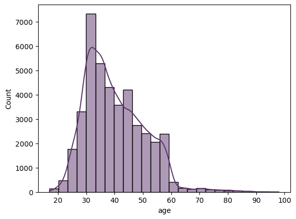
    


    
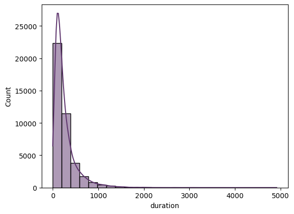
    


    
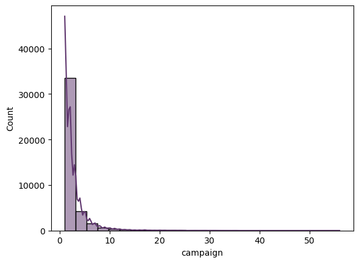
    


    
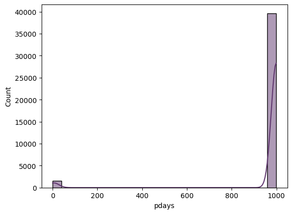
    


    
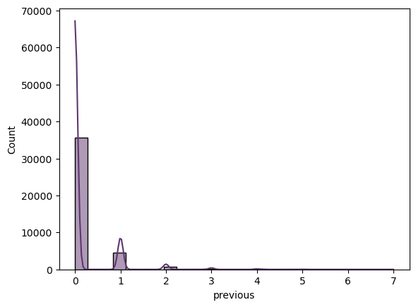
    


    
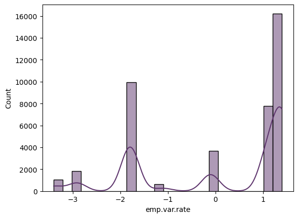
    


    
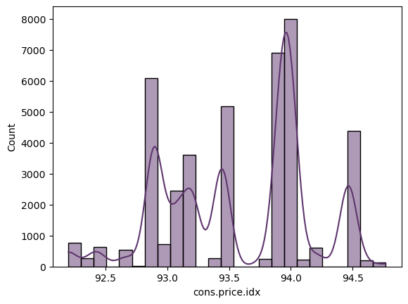
    


    
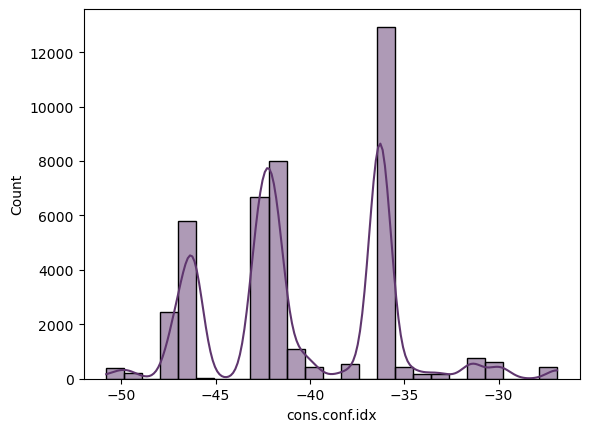
    


    
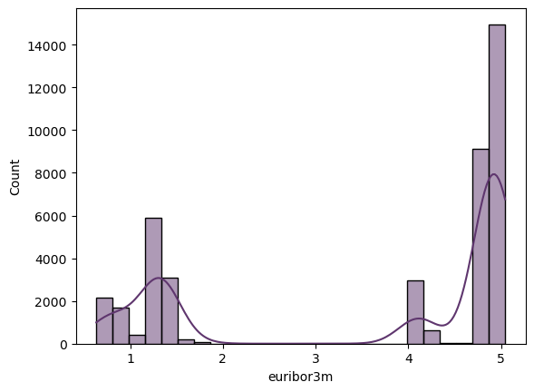
    


    
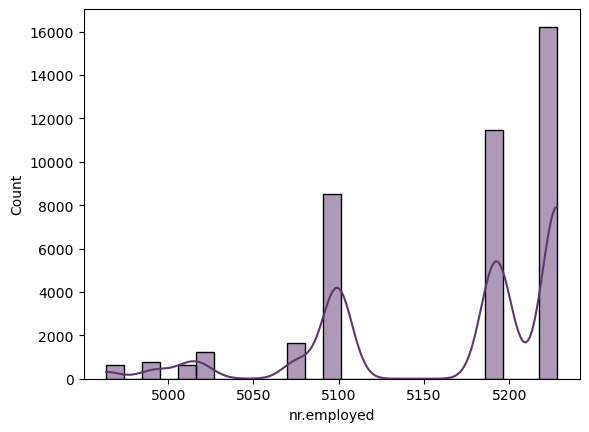
    


```python
for feature in df_obj:
    plt.figure(figsize=(8,3))
    plt.title(f"Count plot of {feature}")
    sns.countplot(x=feature,data=df,palette='viridis')
    plt.xticks(rotation=40)
    plt.show()
```


    
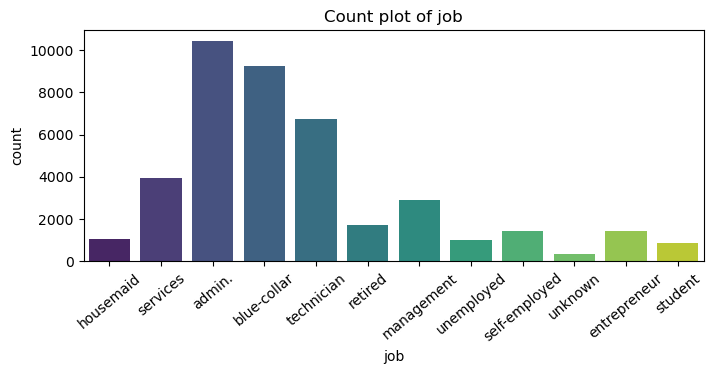
    


    
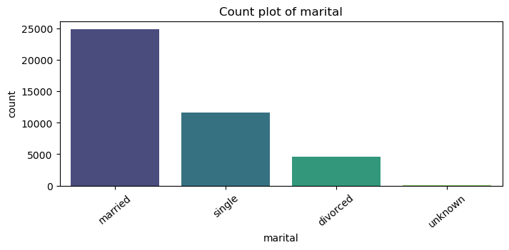
    


    
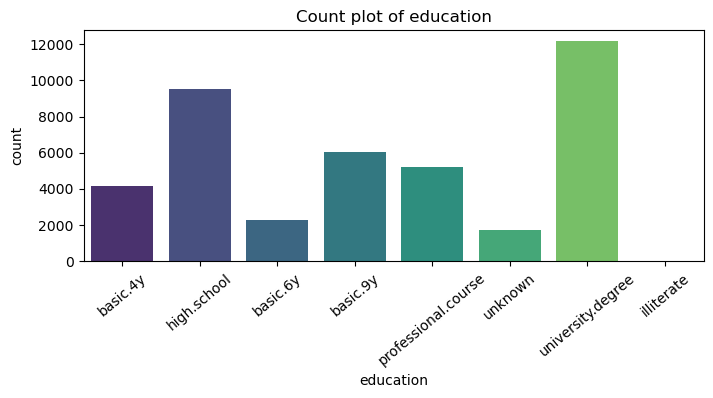
    


    
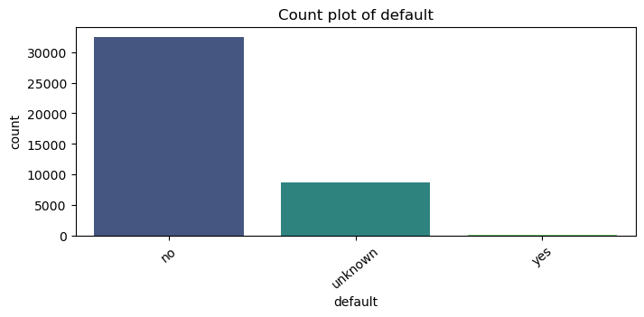
    


    
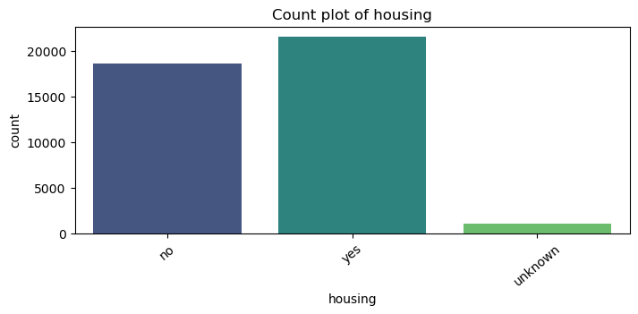
    


    
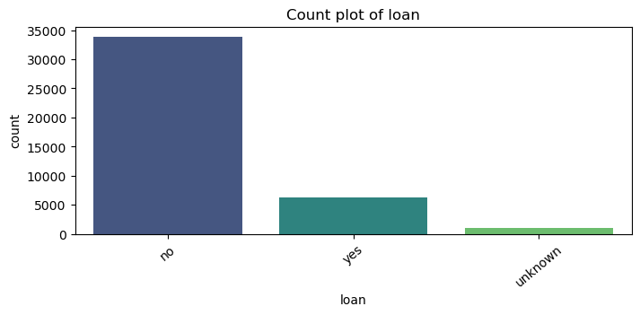
    


    
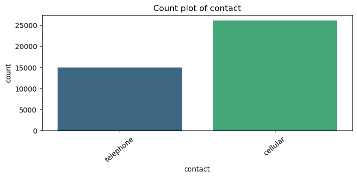
    


    
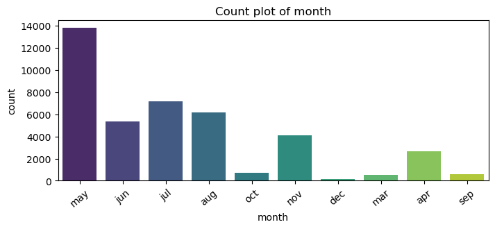
    


    
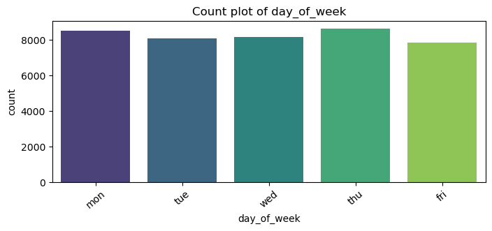
    


    
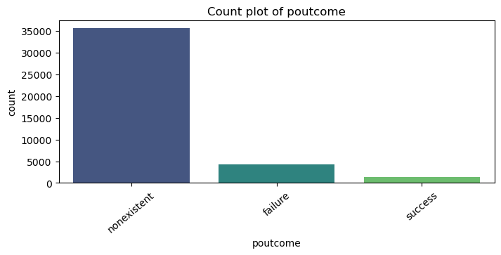
    


    
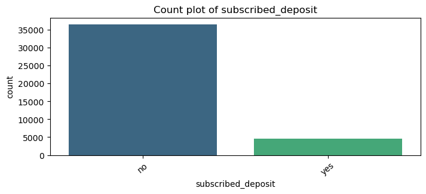
    


<h3>Observations & Insights:</h3>
  <table align="left">
    <tr>
      <th>Category</th>
      <th>Observation</th>
    </tr>
    <tr>
      <td>Job</td>
      <td>Most clients are admins.</td>
    </tr>
    <tr>
      <td>Marital Status</td>
      <td>Most clients are married.</td>
    </tr>
    <tr>
      <td>Education</td>
      <td>Most clients have a university degree.</td>
    </tr>
    <tr>
      <td>Credit Default</td>
      <td>Most clients have no default.</td>
    </tr>
    <tr>
      <td>Housing Loan</td>
      <td>Most clients have a housing loan.</td>
    </tr>
    <tr>
      <td>Personal Loan</td>
      <td>Most clients do not have a personal loan.</td>
    </tr>
    <tr>
      <td>Contact Method</td>
      <td>Cellular is the preferred method.</td>
    </tr>
    <tr>
      <td>Contact Month</td>
      <td>May is the most frequent month.</td>
    </tr>
    <tr>
      <td>Contact Day</td>
      <td>Thursday is the most common day.</td>
    </tr>
    <tr>
      <td>Previous Marketing Outcome</td>
      <td>"Nonexistent" is the most frequent outcome.</td>
    </tr>
    <tr>
      <td>Target</td>
      <td>Most clients haven't subscribed to a term deposit.</td>
    </tr>
  </table>
</body>

<h2>checking for outliers & Treatment for it</h2>


```python
df.plot(kind='box', subplots=True, layout=(5,2), figsize=(10,30))
plt.show()
```


    
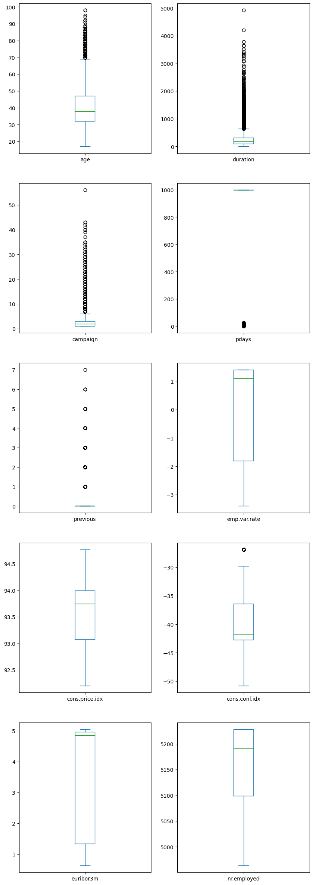
    


```python
columns = ['age', 'campaign', 'duration']

for column in columns:
    q1 = np.percentile(df[column], 25)
    q3 = np.percentile(df[column], 75)
    iqr = q3 - q1
    lower_bound = q1 - 1.5 * iqr
    upper_bound = q3 + 1.5 * iqr
    # Filter the DataFrame for the current column
    df = df[(df[column] >= lower_bound) & (df[column] <= upper_bound)]
df.plot(kind='box', subplots=True, layout=(5,2), figsize=(10,30))
plt.show()
```


    
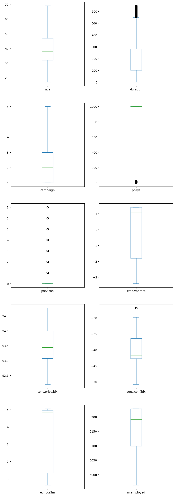
    


<h3>Checking for correlation using heatmap</h3>


```python
# Select only the numerical columns
numerical_df = df.select_dtypes(include=[np.number])

# Create the heatmap
plt.figure(figsize=(10, 8))
sns.heatmap(numerical_df.corr(), annot=True, cmap='coolwarm', vmin=-1, vmax=1)
plt.title('Correlation Matrix Heatmap')
plt.show()
```


    
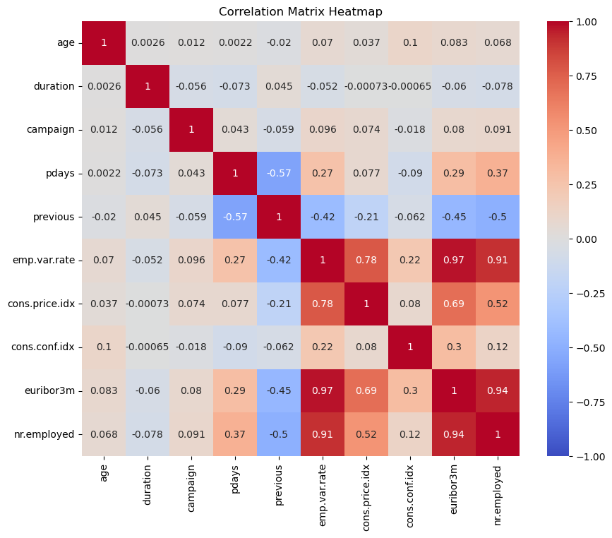
    


```python
high_corr_cols = ['emp.var.rate','euribor3m','nr.employed']
# copy the original dataframe

df1=df.copy()

# Removing high correlated columns from the dataset
df1.drop(high_corr_cols, inplace=True, axis=1)
df1.columns
```


    Index(['age', 'job', 'marital', 'education', 'default', 'housing', 'loan',
           'contact', 'month', 'day_of_week', 'duration', 'campaign', 'pdays',
           'previous', 'poutcome', 'cons.price.idx', 'cons.conf.idx',
           'subscribed_deposit'],
          dtype='object')


<h3>Conversion of categorical columns into numerical columns using label encoder.<h3>


```python
from sklearn.preprocessing import LabelEncoder
le = LabelEncoder()
df_encoded = df1.apply(le.fit_transform)
df_encoded
```


<div>
<style scoped>
    .dataframe tbody tr th:only-of-type {
        vertical-align: middle;
    }

    .dataframe tbody tr th {
        vertical-align: top;
    }

    .dataframe thead th {
        text-align: right;
    }
</style>
<table border="1" class="dataframe">
  <thead>
    <tr style="text-align: right;">
      <th></th>
      <th>age</th>
      <th>job</th>
      <th>marital</th>
      <th>education</th>
      <th>default</th>
      <th>housing</th>
      <th>loan</th>
      <th>contact</th>
      <th>month</th>
      <th>day_of_week</th>
      <th>duration</th>
      <th>campaign</th>
      <th>pdays</th>
      <th>previous</th>
      <th>poutcome</th>
      <th>cons.price.idx</th>
      <th>cons.conf.idx</th>
      <th>subscribed_deposit</th>
    </tr>
  </thead>
  <tbody>
    <tr>
      <th>0</th>
      <td>39</td>
      <td>3</td>
      <td>1</td>
      <td>0</td>
      <td>0</td>
      <td>0</td>
      <td>0</td>
      <td>1</td>
      <td>6</td>
      <td>1</td>
      <td>261</td>
      <td>0</td>
      <td>26</td>
      <td>0</td>
      <td>1</td>
      <td>18</td>
      <td>16</td>
      <td>0</td>
    </tr>
    <tr>
      <th>1</th>
      <td>40</td>
      <td>7</td>
      <td>1</td>
      <td>3</td>
      <td>1</td>
      <td>0</td>
      <td>0</td>
      <td>1</td>
      <td>6</td>
      <td>1</td>
      <td>149</td>
      <td>0</td>
      <td>26</td>
      <td>0</td>
      <td>1</td>
      <td>18</td>
      <td>16</td>
      <td>0</td>
    </tr>
    <tr>
      <th>2</th>
      <td>20</td>
      <td>7</td>
      <td>1</td>
      <td>3</td>
      <td>0</td>
      <td>2</td>
      <td>0</td>
      <td>1</td>
      <td>6</td>
      <td>1</td>
      <td>226</td>
      <td>0</td>
      <td>26</td>
      <td>0</td>
      <td>1</td>
      <td>18</td>
      <td>16</td>
      <td>0</td>
    </tr>
    <tr>
      <th>3</th>
      <td>23</td>
      <td>0</td>
      <td>1</td>
      <td>1</td>
      <td>0</td>
      <td>0</td>
      <td>0</td>
      <td>1</td>
      <td>6</td>
      <td>1</td>
      <td>151</td>
      <td>0</td>
      <td>26</td>
      <td>0</td>
      <td>1</td>
      <td>18</td>
      <td>16</td>
      <td>0</td>
    </tr>
    <tr>
      <th>4</th>
      <td>39</td>
      <td>7</td>
      <td>1</td>
      <td>3</td>
      <td>0</td>
      <td>0</td>
      <td>2</td>
      <td>1</td>
      <td>6</td>
      <td>1</td>
      <td>307</td>
      <td>0</td>
      <td>26</td>
      <td>0</td>
      <td>1</td>
      <td>18</td>
      <td>16</td>
      <td>0</td>
    </tr>
    <tr>
      <th>...</th>
      <td>...</td>
      <td>...</td>
      <td>...</td>
      <td>...</td>
      <td>...</td>
      <td>...</td>
      <td>...</td>
      <td>...</td>
      <td>...</td>
      <td>...</td>
      <td>...</td>
      <td>...</td>
      <td>...</td>
      <td>...</td>
      <td>...</td>
      <td>...</td>
      <td>...</td>
      <td>...</td>
    </tr>
    <tr>
      <th>41181</th>
      <td>20</td>
      <td>0</td>
      <td>1</td>
      <td>6</td>
      <td>0</td>
      <td>2</td>
      <td>0</td>
      <td>0</td>
      <td>7</td>
      <td>0</td>
      <td>281</td>
      <td>0</td>
      <td>26</td>
      <td>0</td>
      <td>1</td>
      <td>25</td>
      <td>0</td>
      <td>1</td>
    </tr>
    <tr>
      <th>41182</th>
      <td>12</td>
      <td>10</td>
      <td>2</td>
      <td>0</td>
      <td>0</td>
      <td>2</td>
      <td>0</td>
      <td>0</td>
      <td>7</td>
      <td>0</td>
      <td>112</td>
      <td>0</td>
      <td>9</td>
      <td>1</td>
      <td>2</td>
      <td>25</td>
      <td>0</td>
      <td>0</td>
    </tr>
    <tr>
      <th>41184</th>
      <td>29</td>
      <td>1</td>
      <td>1</td>
      <td>5</td>
      <td>0</td>
      <td>0</td>
      <td>0</td>
      <td>0</td>
      <td>7</td>
      <td>0</td>
      <td>383</td>
      <td>0</td>
      <td>26</td>
      <td>0</td>
      <td>1</td>
      <td>25</td>
      <td>0</td>
      <td>0</td>
    </tr>
    <tr>
      <th>41185</th>
      <td>39</td>
      <td>5</td>
      <td>1</td>
      <td>6</td>
      <td>0</td>
      <td>2</td>
      <td>0</td>
      <td>0</td>
      <td>7</td>
      <td>0</td>
      <td>189</td>
      <td>1</td>
      <td>26</td>
      <td>0</td>
      <td>1</td>
      <td>25</td>
      <td>0</td>
      <td>0</td>
    </tr>
    <tr>
      <th>41186</th>
      <td>27</td>
      <td>9</td>
      <td>1</td>
      <td>5</td>
      <td>0</td>
      <td>0</td>
      <td>0</td>
      <td>0</td>
      <td>7</td>
      <td>0</td>
      <td>442</td>
      <td>0</td>
      <td>26</td>
      <td>0</td>
      <td>1</td>
      <td>25</td>
      <td>0</td>
      <td>1</td>
    </tr>
  </tbody>
</table>
<p>35550 rows × 18 columns</p>
</div>


<h3>Checking the target variable</h3>


```python
df_encoded['subscribed_deposit'].value_counts(normalize=True)*100
```


    0    91.887482
    1     8.112518
    Name: subscribed_deposit, dtype: float64


```python
# Independent Var
x=df_encoded.iloc[:,:-1]
# Target var
y=df_encoded.iloc[:,-1]
```


```python
x.shape;y.shape
```


    (35550,)


<h3>Splitting the dataset into train and test datasets <h3>


```python
from sklearn.model_selection import train_test_split
x_train, x_test, y_train, y_test = train_test_split(x,y,test_size=0.3,random_state=1)
print(x_train.shape)
print(x_test.shape)
print(y_train.shape)
print(y_test.shape)
```

    (24885, 17)
    (10665, 17)
    (24885,)
    (10665,)
    

<h3>Decision Tree classifier</h3>


```python
from sklearn.tree import DecisionTreeClassifier
dc = DecisionTreeClassifier(criterion='gini',max_depth=5,min_samples_split=10)
dc.fit(x_train,y_train)
```


<style>#sk-container-id-1 {color: black;background-color: white;}#sk-container-id-1 pre{padding: 0;}#sk-container-id-1 div.sk-toggleable {background-color: white;}#sk-container-id-1 label.sk-toggleable__label {cursor: pointer;display: block;width: 100%;margin-bottom: 0;padding: 0.3em;box-sizing: border-box;text-align: center;}#sk-container-id-1 label.sk-toggleable__label-arrow:before {content: "▸";float: left;margin-right: 0.25em;color: #696969;}#sk-container-id-1 label.sk-toggleable__label-arrow:hover:before {color: black;}#sk-container-id-1 div.sk-estimator:hover label.sk-toggleable__label-arrow:before {color: black;}#sk-container-id-1 div.sk-toggleable__content {max-height: 0;max-width: 0;overflow: hidden;text-align: left;background-color: #f0f8ff;}#sk-container-id-1 div.sk-toggleable__content pre {margin: 0.2em;color: black;border-radius: 0.25em;background-color: #f0f8ff;}#sk-container-id-1 input.sk-toggleable__control:checked~div.sk-toggleable__content {max-height: 200px;max-width: 100%;overflow: auto;}#sk-container-id-1 input.sk-toggleable__control:checked~label.sk-toggleable__label-arrow:before {content: "▾";}#sk-container-id-1 div.sk-estimator input.sk-toggleable__control:checked~label.sk-toggleable__label {background-color: #d4ebff;}#sk-container-id-1 div.sk-label input.sk-toggleable__control:checked~label.sk-toggleable__label {background-color: #d4ebff;}#sk-container-id-1 input.sk-hidden--visually {border: 0;clip: rect(1px 1px 1px 1px);clip: rect(1px, 1px, 1px, 1px);height: 1px;margin: -1px;overflow: hidden;padding: 0;position: absolute;width: 1px;}#sk-container-id-1 div.sk-estimator {font-family: monospace;background-color: #f0f8ff;border: 1px dotted black;border-radius: 0.25em;box-sizing: border-box;margin-bottom: 0.5em;}#sk-container-id-1 div.sk-estimator:hover {background-color: #d4ebff;}#sk-container-id-1 div.sk-parallel-item::after {content: "";width: 100%;border-bottom: 1px solid gray;flex-grow: 1;}#sk-container-id-1 div.sk-label:hover label.sk-toggleable__label {background-color: #d4ebff;}#sk-container-id-1 div.sk-serial::before {content: "";position: absolute;border-left: 1px solid gray;box-sizing: border-box;top: 0;bottom: 0;left: 50%;z-index: 0;}#sk-container-id-1 div.sk-serial {display: flex;flex-direction: column;align-items: center;background-color: white;padding-right: 0.2em;padding-left: 0.2em;position: relative;}#sk-container-id-1 div.sk-item {position: relative;z-index: 1;}#sk-container-id-1 div.sk-parallel {display: flex;align-items: stretch;justify-content: center;background-color: white;position: relative;}#sk-container-id-1 div.sk-item::before, #sk-container-id-1 div.sk-parallel-item::before {content: "";position: absolute;border-left: 1px solid gray;box-sizing: border-box;top: 0;bottom: 0;left: 50%;z-index: -1;}#sk-container-id-1 div.sk-parallel-item {display: flex;flex-direction: column;z-index: 1;position: relative;background-color: white;}#sk-container-id-1 div.sk-parallel-item:first-child::after {align-self: flex-end;width: 50%;}#sk-container-id-1 div.sk-parallel-item:last-child::after {align-self: flex-start;width: 50%;}#sk-container-id-1 div.sk-parallel-item:only-child::after {width: 0;}#sk-container-id-1 div.sk-dashed-wrapped {border: 1px dashed gray;margin: 0 0.4em 0.5em 0.4em;box-sizing: border-box;padding-bottom: 0.4em;background-color: white;}#sk-container-id-1 div.sk-label label {font-family: monospace;font-weight: bold;display: inline-block;line-height: 1.2em;}#sk-container-id-1 div.sk-label-container {text-align: center;}#sk-container-id-1 div.sk-container {/* jupyter's `normalize.less` sets `[hidden] { display: none; }` but bootstrap.min.css set `[hidden] { display: none !important; }` so we also need the `!important` here to be able to override the default hidden behavior on the sphinx rendered scikit-learn.org. See: https://github.com/scikit-learn/scikit-learn/issues/21755 */display: inline-block !important;position: relative;}#sk-container-id-1 div.sk-text-repr-fallback {display: none;}</style><div id="sk-container-id-1" class="sk-top-container"><div class="sk-text-repr-fallback"><pre>DecisionTreeClassifier(max_depth=5, min_samples_split=10)</pre><b>In a Jupyter environment, please rerun this cell to show the HTML representation or trust the notebook. <br />On GitHub, the HTML representation is unable to render, please try loading this page with nbviewer.org.</b></div><div class="sk-container" hidden><div class="sk-item"><div class="sk-estimator sk-toggleable"><input class="sk-toggleable__control sk-hidden--visually" id="sk-estimator-id-1" type="checkbox" checked><label for="sk-estimator-id-1" class="sk-toggleable__label sk-toggleable__label-arrow">DecisionTreeClassifier</label><div class="sk-toggleable__content"><pre>DecisionTreeClassifier(max_depth=5, min_samples_split=10)</pre></div></div></div></div></div>


<B>Please rerun this cell in a Jupyter environment to display the HTML representation or trust the notebook. On GitHub, the HTML representation may not render correctly; consider accessing the page through nbviewer.org for proper display.</B>


```python
#Evaluating Training and Testing Accuracy

print("Training accuracy:",dc.score(x_train,y_train))
print("Testing accuracy:",dc.score(x_test,y_test))
```

    Training accuracy: 0.9369901547116737
    Testing accuracy: 0.93314580403188
    


```python
y_pred=dc.predict(x_test)
```


```python
#Evaluating Prediction Accuracy
from sklearn.metrics import confusion_matrix,classification_report,accuracy_score
print(accuracy_score(y_test,y_pred))
```

    0.93314580403188
    


```python
print(confusion_matrix(y_test,y_pred))
```

    [[9599  214]
     [ 499  353]]
    


```python
print(classification_report(y_test,y_pred))
```

                  precision    recall  f1-score   support
    
               0       0.95      0.98      0.96      9813
               1       0.62      0.41      0.50       852
    
        accuracy                           0.93     10665
       macro avg       0.79      0.70      0.73     10665
    weighted avg       0.92      0.93      0.93     10665
    
    

<h3>Plot Decision Tree</h3>


```python
from sklearn.tree import plot_tree
feature_names=df.columns.tolist()
plt.figure(figsize=(40,20))
class_names=["class_0","class_1"]
plot_tree(dc, feature_names=feature_names, class_names=class_names, filled=True,fontsize=12)
plt.show()
```


    
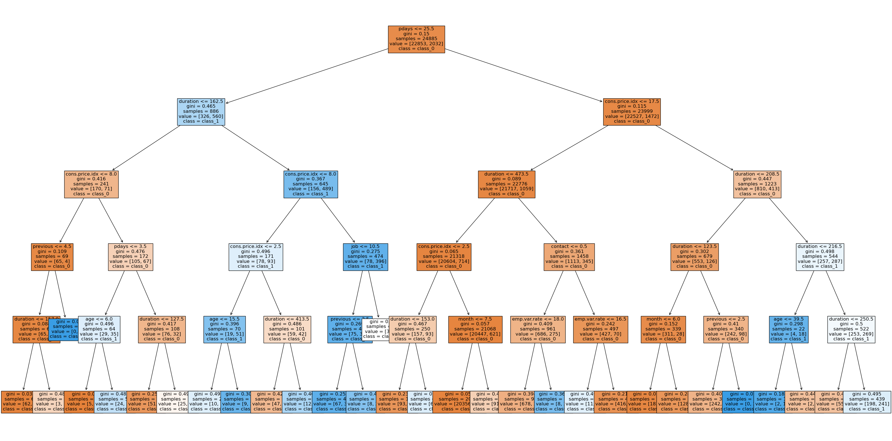
    


```python
#Decision Tree classifier using 'entropy' criterion
dc1=DecisionTreeClassifier(criterion='entropy',max_depth=5,min_samples_split=10)
dc1.fit(x_train,y_train)
```


<style>#sk-container-id-2 {color: black;background-color: white;}#sk-container-id-2 pre{padding: 0;}#sk-container-id-2 div.sk-toggleable {background-color: white;}#sk-container-id-2 label.sk-toggleable__label {cursor: pointer;display: block;width: 100%;margin-bottom: 0;padding: 0.3em;box-sizing: border-box;text-align: center;}#sk-container-id-2 label.sk-toggleable__label-arrow:before {content: "▸";float: left;margin-right: 0.25em;color: #696969;}#sk-container-id-2 label.sk-toggleable__label-arrow:hover:before {color: black;}#sk-container-id-2 div.sk-estimator:hover label.sk-toggleable__label-arrow:before {color: black;}#sk-container-id-2 div.sk-toggleable__content {max-height: 0;max-width: 0;overflow: hidden;text-align: left;background-color: #f0f8ff;}#sk-container-id-2 div.sk-toggleable__content pre {margin: 0.2em;color: black;border-radius: 0.25em;background-color: #f0f8ff;}#sk-container-id-2 input.sk-toggleable__control:checked~div.sk-toggleable__content {max-height: 200px;max-width: 100%;overflow: auto;}#sk-container-id-2 input.sk-toggleable__control:checked~label.sk-toggleable__label-arrow:before {content: "▾";}#sk-container-id-2 div.sk-estimator input.sk-toggleable__control:checked~label.sk-toggleable__label {background-color: #d4ebff;}#sk-container-id-2 div.sk-label input.sk-toggleable__control:checked~label.sk-toggleable__label {background-color: #d4ebff;}#sk-container-id-2 input.sk-hidden--visually {border: 0;clip: rect(1px 1px 1px 1px);clip: rect(1px, 1px, 1px, 1px);height: 1px;margin: -1px;overflow: hidden;padding: 0;position: absolute;width: 1px;}#sk-container-id-2 div.sk-estimator {font-family: monospace;background-color: #f0f8ff;border: 1px dotted black;border-radius: 0.25em;box-sizing: border-box;margin-bottom: 0.5em;}#sk-container-id-2 div.sk-estimator:hover {background-color: #d4ebff;}#sk-container-id-2 div.sk-parallel-item::after {content: "";width: 100%;border-bottom: 1px solid gray;flex-grow: 1;}#sk-container-id-2 div.sk-label:hover label.sk-toggleable__label {background-color: #d4ebff;}#sk-container-id-2 div.sk-serial::before {content: "";position: absolute;border-left: 1px solid gray;box-sizing: border-box;top: 0;bottom: 0;left: 50%;z-index: 0;}#sk-container-id-2 div.sk-serial {display: flex;flex-direction: column;align-items: center;background-color: white;padding-right: 0.2em;padding-left: 0.2em;position: relative;}#sk-container-id-2 div.sk-item {position: relative;z-index: 1;}#sk-container-id-2 div.sk-parallel {display: flex;align-items: stretch;justify-content: center;background-color: white;position: relative;}#sk-container-id-2 div.sk-item::before, #sk-container-id-2 div.sk-parallel-item::before {content: "";position: absolute;border-left: 1px solid gray;box-sizing: border-box;top: 0;bottom: 0;left: 50%;z-index: -1;}#sk-container-id-2 div.sk-parallel-item {display: flex;flex-direction: column;z-index: 1;position: relative;background-color: white;}#sk-container-id-2 div.sk-parallel-item:first-child::after {align-self: flex-end;width: 50%;}#sk-container-id-2 div.sk-parallel-item:last-child::after {align-self: flex-start;width: 50%;}#sk-container-id-2 div.sk-parallel-item:only-child::after {width: 0;}#sk-container-id-2 div.sk-dashed-wrapped {border: 1px dashed gray;margin: 0 0.4em 0.5em 0.4em;box-sizing: border-box;padding-bottom: 0.4em;background-color: white;}#sk-container-id-2 div.sk-label label {font-family: monospace;font-weight: bold;display: inline-block;line-height: 1.2em;}#sk-container-id-2 div.sk-label-container {text-align: center;}#sk-container-id-2 div.sk-container {/* jupyter's `normalize.less` sets `[hidden] { display: none; }` but bootstrap.min.css set `[hidden] { display: none !important; }` so we also need the `!important` here to be able to override the default hidden behavior on the sphinx rendered scikit-learn.org. See: https://github.com/scikit-learn/scikit-learn/issues/21755 */display: inline-block !important;position: relative;}#sk-container-id-2 div.sk-text-repr-fallback {display: none;}</style><div id="sk-container-id-2" class="sk-top-container"><div class="sk-text-repr-fallback"><pre>DecisionTreeClassifier(criterion=&#x27;entropy&#x27;, max_depth=5, min_samples_split=10)</pre><b>In a Jupyter environment, please rerun this cell to show the HTML representation or trust the notebook. <br />On GitHub, the HTML representation is unable to render, please try loading this page with nbviewer.org.</b></div><div class="sk-container" hidden><div class="sk-item"><div class="sk-estimator sk-toggleable"><input class="sk-toggleable__control sk-hidden--visually" id="sk-estimator-id-2" type="checkbox" checked><label for="sk-estimator-id-2" class="sk-toggleable__label sk-toggleable__label-arrow">DecisionTreeClassifier</label><div class="sk-toggleable__content"><pre>DecisionTreeClassifier(criterion=&#x27;entropy&#x27;, max_depth=5, min_samples_split=10)</pre></div></div></div></div></div>


<B>Please rerun this cell in a Jupyter environment to display the HTML representation or trust the notebook. On GitHub, the HTML representation may not render correctly; consider accessing the page through nbviewer.org for proper display.</B>


```python
#Evaluating Training and Testing Accuracy
print("Training accuracy:",dc1.score(x_train,y_train))
print("Testing accuracy:",dc1.score(x_test,y_test))
```

    Training accuracy: 0.9359855334538879
    Testing accuracy: 0.9316455696202531
    


```python
y1_pred=dc1.predict(x_test)
```


```python
#Evaluating Prediction Accuracy
print(accuracy_score(y_test,y1_pred))
```

    0.9316455696202531
    


```python
print(confusion_matrix(y_test,y1_pred))
```

    [[9654  159]
     [ 570  282]]
    


```python
print(classification_report(y_test,y1_pred))
```

                  precision    recall  f1-score   support
    
               0       0.94      0.98      0.96      9813
               1       0.64      0.33      0.44       852
    
        accuracy                           0.93     10665
       macro avg       0.79      0.66      0.70     10665
    weighted avg       0.92      0.93      0.92     10665
    
    


```python
cn=['no','yes']
fn=x_train.columns
plt.figure(figsize=(40,20))
plot_tree(dc1, feature_names=fn.tolist(), class_names=cn, filled=True,fontsize=12)
plt.show()
```


    
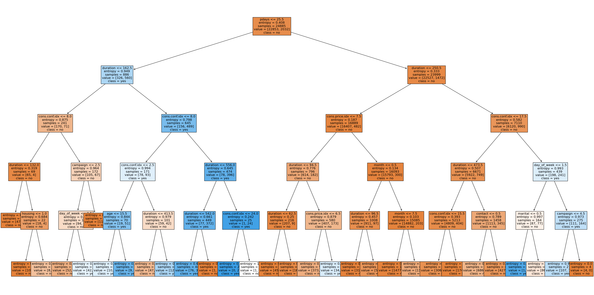
    


<h1>Conclusion</h1>

  <h2>Decision Tree Criteria: Gini vs. Entropy</h2>
  <h3>Both Gini and Entropy Criteria Deliver Strong Results</h3>
  <p>When comparing Gini impurity and entropy as criteria for building decision trees, both methods achieve impressive accuracy:</p>
  <ul>
    <li>Training accuracy: Around 93.6% for both</li>
    <li>Testing accuracy:</li>
      <ul>
        <li>Gini: Around 93.3%</li>
        <li>Entropy: Around 93.2%</li>
      </ul>
  </ul>
  <h3>Gini for Identifying True Positives</h3>
  <p>While the difference in testing accuracy is minimal, Gini shows a slight advantage. It excels at correctly identifying positive instances (represented by class 1). This means Gini might be preferable when accurately predicting positive cases is crucial.</p>
  <h3>Entropy for Reducing False Positives</h3>
  <p>Entropy results in fewer false positives (incorrectly predicted positives) but comes at the cost of potentially missing some true positives (false negatives). This suggests using Entropy if minimizing false positives is a higher priority.</p>
  <h3>Choosing the Right Criterion</h3>
  <p>The best choice between Gini and Entropy depends on the specific application and its priorities. If accurately identifying true positives is paramount, Gini might be better. If minimizing false positives is the main concern, Entropy could be a better fit.</p>


